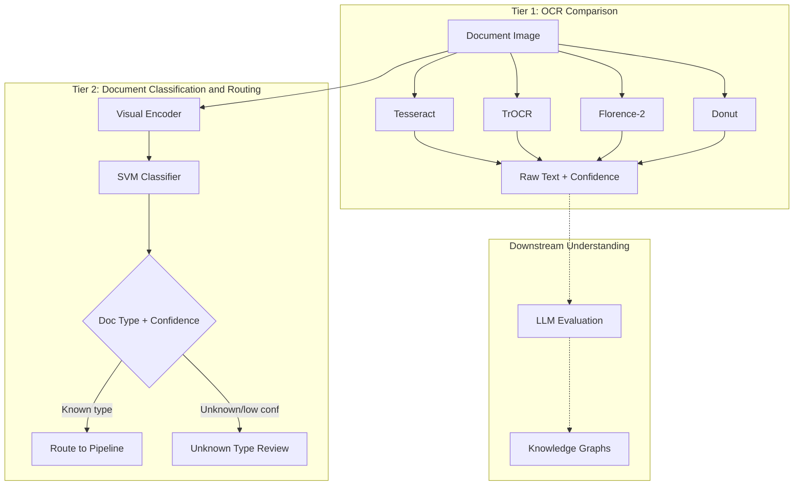

# OCR Pipeline: From Classical to Neural with Document Routing

**Status**: 🚧 Active Development

Comparing classical and neural OCR approaches, with a hybrid document classification layer for intelligent routing.

> **Current state**: Notebook 01 (model comparison) is implemented with working code. Notebooks 02-03 contain design documentation and code sketches. Scripts exist but need testing. This README describes the intended end state.

## The Challenge

OCR seems like a solved problem - tools like Tesseract have existed for decades, and neural models claim superhuman accuracy. But production reality is messier:

- **Real-world images are degraded**: blur, rotation, poor lighting, compression artifacts
- **Cost matters**: Neural models are expensive to run - when is Tesseract "good enough"?
- **OCR outputs text but doesn't validate correctness**: How do you know when OCR is wrong?

This project tackles these questions through systematic comparison and a document classification layer for intelligent routing.

## Key Insight: OCR Doesn't "Understand"

> **OCR models are visual pattern → text converters. They don't understand content.**

Consider these examples:
- `Invoice #ABC` vs `Invoice #123` - both look valid to OCR
- `Total: €1,234.56` vs `Total: €1.234,56` - OCR doesn't know which format is correct
- A medical prescription with a drug name misspelled - OCR will faithfully transcribe the error

**This means:**
- OCR alone can't validate semantic correctness
- You need downstream models for understanding (LLMs, domain classifiers)
- Document classification enables intelligent routing; semantic validation requires downstream models

## Architecture

This project implements a two-tier architecture that separates text extraction from document routing:



**Note on "validation"**: Tier 2 classifies *document type* for routing, not OCR quality. True validation of OCR correctness requires downstream semantic checks (LLMs, business rules) - see the [`llm_eval_harness`](../llm_eval_harness) project.

## Notebook Progression

This project follows a structured learning path through three notebooks:

| Notebook | Purpose | Key Skills Demonstrated |
|----------|---------|-------------------------|
| **01_ocr_experiments.ipynb** | Compare Tesseract vs neural models (TrOCR, Florence-2, Donut, etc.) on various datasets with robustness testing | Model evaluation, MLflow tracking, systematic comparison methodology |
| **02_encoder_features.ipynb** | Extract visual embeddings from encoder (before text generation), visualize latent space with t-SNE/UMAP | Feature engineering, understanding transformer internals, dimensionality reduction |
| **03_hybrid_svm_classifier.ipynb** | Build document routing layer: use encoder embeddings + SVM for document type classification and routing decisions | Classical ML + DL hybrid systems, production patterns, interpretable routing |

**Start here**: `01_ocr_experiments.ipynb` - Compare OCR approaches and understand when each works best.

## Datasets: Clean → Noisy Progression

We evaluate on a progression of datasets to understand model robustness:

| Dataset | Type | Quality | Why It Matters |
|---------|------|---------|----------------|
| Synthetic (generated) | Text images | Perfect | Golden set baseline - isolates model capability |
| [md_invoices](https://huggingface.co/datasets/Am0MuK/md_invoices) | Invoices | Clean, structured | Real documents but high quality |
| [XFUND](https://huggingface.co/datasets/nnul/xfund-multilingual) | Forms | Multilingual | Tests language handling |
| [FUNSD](https://huggingface.co/datasets/nielsr/funsd) | Forms | English, annotated | Layout complexity |
| [CORD](https://huggingface.co/datasets/naver-clova-ix/cord-v2) | Receipts | Real-world | Real business use case |
| [SROIE](https://rrc.cvc.uab.es/?ch=13) | Receipts | Real-world | Structured fields for validation |
| [scanned_receipts](https://huggingface.co/datasets/Voxel51/scanned_receipts) | Receipts | Noisy, degraded | Worst-case production scenario |

This progression reveals **where models break** and helps build augmentation strategies for robustness.

## Skills Demonstrated

This project showcases a broad ML engineering skillset:

### Core Technical Skills
- **Classical OCR**: Tesseract, pytesseract, understanding when simple tools suffice
- **Transformer Models**: TrOCR, Florence-2, Donut, GOT-OCR2, understanding encoder-decoder architectures
- **Computer Vision**: Image preprocessing, augmentation, robustness testing
- **Classical ML**: SVM, sklearn pipelines, feature engineering from deep embeddings

### MLOps & Production
- **Experiment Tracking**: MLflow integration for reproducible comparisons
- **Model Evaluation**: CER, WER, confidence calibration, robustness sweeps
- **Production Patterns**: Confidence-based routing, human-in-the-loop design
- **Cost-Accuracy Tradeoffs**: Knowing when Tesseract beats neural models

### System Design
- **Hybrid Architectures**: Combining classical ML with deep learning
- **Document Routing**: Building interpretable classification for pipeline routing
- **Pipeline Design**: Multi-stage systems with clear separation of concerns

## Quick Start

```bash
# Start MLflow tracking server (in separate terminal)
cd /path/to/ml_portfolio
uv run mlflow server --host 0.0.0.0 --port 5000

# Open the comparison notebook
uv run jupyter lab projects/ocr_pipeline/notebooks/01_ocr_experiments.ipynb

# MLflow UI available at: http://localhost:5000
```

The notebook includes:
- Interactive model selection (Tesseract, TrOCR, Florence-2, Donut, etc.)
- Dataset switching (synthetic → real-world)
- Robustness testing sliders (blur, rotation, JPEG compression)
- Automatic MLflow logging

## Evaluation Metrics

### Primary Metrics

| Metric | Description | Target |
|--------|-------------|--------|
| **CER** | Character Error Rate | < 5% |
| **WER** | Word Error Rate | < 10% |
| **Field Exact Match** | Per-field accuracy (for structured data) | > 85% |
| **Confidence Calibration** | How well confidence scores predict errors | High correlation |

### Robustness Tests

| Perturbation | Intensities | Purpose |
|--------------|-------------|---------|
| Gaussian blur | σ = 0.5, 1.0, 2.0, 3.0 | Simulate fax machines, bad scans |
| Rotation | ±5°, ±10°, ±15° | Misaligned scanning |
| JPEG compression | quality = 75, 50, 25 | Network transmission, storage |
| Brightness | ±20%, ±40% | Lighting variations |

These tests reveal **failure modes** before deployment and guide preprocessing strategies.

## Project Structure

```
projects/ocr_pipeline/
├── configs/
│   └── default.yaml                    # Training configuration
├── notebooks/
│   ├── 01_ocr_experiments.ipynb        # ⭐ Start here! Model comparison
│   ├── 02_encoder_features.ipynb       # Feature extraction & visualization
│   └── 03_hybrid_svm_classifier.ipynb  # Document routing
├── scripts/
│   ├── download_data.py                # Download datasets
│   ├── train.py                        # Fine-tune models
│   ├── evaluate.py                     # Full evaluation pipeline
│   ├── export.py                       # ONNX export
│   └── serve.py                        # FastAPI server
├── project/
│   ├── data.py                         # Dataset wrappers
│   ├── model.py                        # Model wrappers
│   ├── preprocess.py                   # Image preprocessing
│   ├── postprocess.py                  # Text postprocessing
│   ├── train.py                        # Training loop
│   └── eval.py                         # Evaluation logic
└── tests/
    └── test_trocr_smoke.py             # Basic tests
```

## Key Design Decisions

<details>
<summary><strong>Why start with Tesseract?</strong></summary>

Tesseract provides the baseline for comparison:

- **Free and fast**: No GPU required, runs on any hardware
- **Production-proven**: Used in production for decades
- **When it's enough**: For clean, printed text, Tesseract often suffices
- **Cost baseline**: Helps quantify the value of neural models

Starting here teaches you to ask: "Do I really need deep learning for this?"

</details>

<details>
<summary><strong>Why TrOCR and other neural models?</strong></summary>

Neural models excel where classical OCR fails:

- **TrOCR**: Transformer architecture (ViT encoder + RoBERTa decoder), excellent for line-level text
- **Florence-2**: Multi-task VLM, can do OCR + layout + detection in one model
- **Donut**: End-to-end document understanding without text detection step
- **GOT-OCR2**: Recent model with strong performance on diverse OCR tasks

Each has different tradeoffs in speed, accuracy, and capabilities. Systematic comparison reveals which to use when.

</details>

<details>
<summary><strong>Why a hybrid document routing approach?</strong></summary>

Production document processing needs intelligent routing:

- **Different document types need different pipelines**: Invoices → extraction, Letters → archival, Forms → structured parsing
- **Unknown documents need human review**: Can't blindly process everything

**What the SVM actually does**:
- **Task**: Classifies *document type* (Invoice, Receipt, Letter, etc.) from visual embeddings
- **Training data**: Manually labeled documents by type
- **Purpose**: Route documents to appropriate processing pipelines; flag unknown types for review

**The hybrid approach**:

1. **Extract encoder embeddings** (one forward pass through vision encoder)
2. **Train SVM on embeddings** for document classification
3. **Use distance-to-hyperplane for routing** (but note: raw distance ≠ calibrated probability - requires Platt scaling or isotonic calibration)
4. **Route based on calibrated confidence**: Known type + high confidence → appropriate pipeline, Unknown/low confidence → human review

**Cost caveat**: The encoder forward pass is still the expensive part. The SVM adds minimal overhead *after* you already have embeddings. True cost savings come from reusing embeddings across multiple downstream tasks, not from avoiding the encoder.

**Note**: This is *routing*, not *validation*. Validating that OCR output is correct requires semantic checks (business rules, LLM verification) - that's a separate concern addressed in downstream processing.

</details>

<details>
<summary><strong>Why link to LLM evaluation?</strong></summary>

OCR is just the first step:

- **OCR extracts text** - visual pattern to string
- **LLMs understand meaning** - semantic validation, entity extraction, knowledge integration

Example: Medical prescription OCR
1. OCR: `"Patient: Max Mustermann, Drug: Aspriin 100mg"`
2. LLM: Detects misspelling "Aspriin" → "Aspirin", validates dosage is reasonable
3. Knowledge graph: Links to drug database, checks interactions

**LLM validator risks to acknowledge**:
- **Hallucinated corrections**: LLM may "fix" text that was actually correct
- **Privacy/compliance**: Sending OCR output to external LLM APIs may violate data policies
- **Evaluation difficulty**: How do you measure if LLM improved or invented?

These risks are explored in the `llm_eval_harness` project - the connection isn't just "use LLM", it's "evaluate whether LLM helps".

</details>

## Results

*Benchmark results comparing Tesseract, TrOCR, Florence-2, and Donut across datasets will be added after experimental runs are complete.*

Expected comparison axes:
- CER/WER by dataset quality
- Inference latency (CPU vs GPU)
- Robustness to perturbations
- Cost per 1000 images

## Next Steps & Related Projects

### Within This Project
1. Complete all three notebooks with implementations
2. Run full benchmark suite across models and datasets
3. Train SVM classifier on encoder embeddings
4. Deploy FastAPI server with hybrid routing

### Connections to Other Projects

- **[LLM Evaluation Harness](../llm_eval_harness)**: For semantic understanding and validation of OCR output. Includes OCR post-processing quality evaluation.
- **[Multimodal Fusion](../multimodal_fusion)**: Combining OCR with other modalities (audio, structured data).
- **[ONNX Export Hub](../onnx_export_hub)**: Optimizing models for production deployment.

### Future Enhancements
- **MedGemma integration**: Domain-specific understanding for medical documents
- **Layout analysis**: Combine with detection models (YOLO, SAM) for full document parsing
- **Active learning loop**: Use low-confidence samples to improve models

## References

### Papers
- [TrOCR: Transformer-based OCR with Pre-trained Models](https://arxiv.org/abs/2109.10282)
- [Donut: Document Understanding Transformer](https://arxiv.org/abs/2111.15664)
- [Florence-2: Advancing a Unified Representation for a Variety of Vision Tasks](https://arxiv.org/abs/2311.06242)

### Datasets
- [SROIE: Scanned Receipts OCR and Information Extraction](https://rrc.cvc.uab.es/?ch=13)
- [CORD: Consolidated Receipt Dataset](https://github.com/clovaai/cord)

### Tools
- [Tesseract OCR](https://github.com/tesseract-ocr/tesseract)
- [Hugging Face Transformers](https://huggingface.co/docs/transformers)
- [MLflow](https://mlflow.org/)
