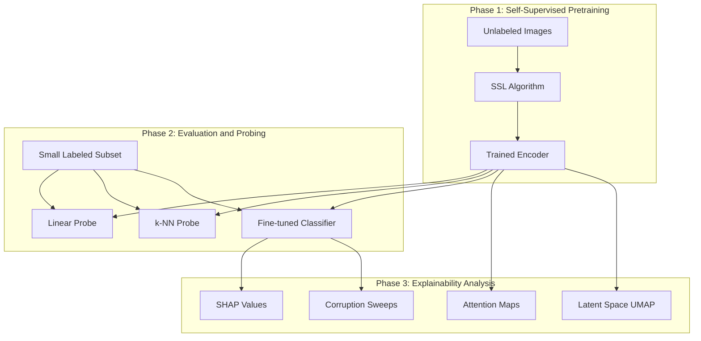

# Vision SSL Transfer: Self-Supervised Learning with Explainability

**Status**: 🚧 Active Development (design complete, implementation in progress)

Self-supervised pretraining on unlabeled data, with a focus on **understanding what downstream classifiers learn from SSL features** through SHAP, attention visualization, and latent space analysis.

> **Current state**: This README describes the intended architecture and experiments. Notebooks contain design documentation but are not yet fully implemented. The tortoise dataset has not been collected yet.

> **Important distinction**: SHAP and attention explain *classifier decisions*, not SSL representations directly. We use probing tasks to *indirectly* understand what information SSL encodes.

## The Challenge

Most ML tutorials assume you have thousands of labeled images. Reality is different:

- **Labels are expensive**: Manual annotation costs time and money
- **Data is abundant but messy**: Phone dumps, surveillance footage, uncurated collections
- **SSL promises label-free learning**: But does it actually work? What does it learn?

This project tackles the gap between SSL theory and practice by:
1. Training SSL models on unlabeled data
2. **Explaining what they learn** (not just reporting accuracy)
3. Validating on a real-world use case

## Key Insight: SSL Learns Features, But Which Ones?

> **Most SSL demos stop at accuracy numbers. We go further: what information do SSL features encode?**

Self-supervised learning learns "features" without labels. But this is a black box:
- Does SimCLR learn texture or shape?
- Does MAE learn local patterns or global structure?
- When SSL fails, *why* does it fail?

**This project investigates these questions using:**
- **SHAP values**: Which image regions drive *classifier* predictions? (Note: SHAP explains the downstream task, not SSL training directly)
- **Attention maps**: Where does the transformer attend? (Caveat: attention is not a reliable causal explanation, but useful for debugging)
- **Latent space visualization**: Do classes naturally separate without supervision?
- **Probing classifiers**: What task-relevant information is recoverable from embeddings?

## Architecture



## Notebook Progression

This project follows a structured learning path:

| Notebook | Purpose | Key Skills Demonstrated |
|----------|---------|-------------------------|
| **01_ssl_pretraining.ipynb** | Train SSL models (SimCLR, MAE) on unlabeled data | Self-supervised learning, contrastive vs generative approaches |
| **02_transfer_evaluation.ipynb** | Evaluate representations with linear probe, k-NN, fine-tuning | Transfer learning, representation quality assessment |
| **03_shap_explainability.ipynb** | SHAP analysis to understand what drives predictions | Explainable AI, feature attribution, model interpretation |
| **04_attention_visualization.ipynb** | Visualize attention patterns and latent space | Transformer internals, UMAP, debugging learned features |
| **05_robustness_analysis.ipynb** | Test model under corruptions (blur, noise, occlusion) | Robustness evaluation, failure mode analysis |

**Start here**: `01_ssl_pretraining.ipynb` - Understand how SSL learns from unlabeled data.

## Datasets

### Development Dataset: Oxford-IIIT Pet

For reproducible experiments and comparison with published results:

| Property | Value |
|----------|-------|
| **Images** | 7,349 (37 breeds of cats and dogs) |
| **Task** | Species classification (cat vs dog) or breed classification |
| **Why this dataset** | Well-documented, comparable to tutorials, varied backgrounds |

### Real-World Validation: Tortoise Detection

A friend's photo dump - thousands of images from a tortoise enclosure:

| Property | Value |
|----------|-------|
| **Images** | ~2,000+ (unlabeled) |
| **Task** | Binary: Is a tortoise present? |
| **Challenges** | Occlusion, camouflage, background changes over time |
| **Labels** | 50-100 manually labeled for fine-tuning |

This represents the **real SSL use case**: abundant unlabeled data, expensive labels, domain-specific challenges.

### Negative Sample Strategy

For the tortoise task, "negative" samples are:
- Empty enclosure shots
- Enclosure with plants/rocks but no tortoise
- Water reflections, shadows that might confuse simple models

The key challenge: **background evolves** (seasons, maintenance, tortoise moving things).

### Data Splitting Strategy (Critical)

Photo dumps from a single source have hidden dependencies that can cause data leakage:

| Risk | Mitigation |
|------|------------|
| **Near-duplicates** | Burst photos within seconds are essentially the same image. Split by *time gap* (e.g., 5+ minute separation). |
| **Temporal correlation** | Background/lighting changes over days. Split by *date* to ensure train/test are from different time periods. |
| **Scene memorization** | Same corner of enclosure appears repeatedly. Ensure geographic diversity or acknowledge limitation. |

**Our approach**:
1. Sort images by timestamp
2. Create train/val/test splits by *date ranges* (not random shuffle)
3. Ensure at least 1-week gap between train and test periods
4. Report performance on "seen backgrounds" vs "unseen backgrounds" separately

*Without explicit temporal splitting, the model may memorize backgrounds rather than learn tortoise features.*

## SSL Approaches Compared

| Method | Type | Key Idea | Expected Strength |
|--------|------|----------|-------------------|
| **SimCLR** | Contrastive | Learn invariance to augmentations | Good for distinguishing instances |
| **MoCo v3** | Contrastive | Momentum encoder for stability | Scalable, efficient |
| **MAE** | Generative | Reconstruct masked patches | Better for occluded objects |
| **DINO** | Self-distillation | Learn from self without labels | Strong semantic features |

**Hypothesis to test**: MAE *may* outperform contrastive methods for tortoise detection because:
- Tortoise is often **partially occluded** (under bushes, rocks)
- Reconstruction tasks *may* encourage learning structural completion

**Caveat**: The claim that "contrastive = global, MAE = local" is an oversimplification. Actual behavior depends heavily on architecture, augmentations, and masking strategy. This is a testable hypothesis, not a known fact.

## Skills Demonstrated

### Core Technical Skills
- **Self-Supervised Learning**: SimCLR, MAE, contrastive vs generative paradigms
- **Transfer Learning**: Linear probing, k-NN, fine-tuning strategies
- **Vision Transformers**: ViT architecture, attention mechanisms, `timm` library
- **Explainable AI**: SHAP, attention visualization, feature attribution

### MLOps & Production
- **Experiment Tracking**: MLflow integration for comparing SSL approaches
- **Data Pipelines**: Handling unlabeled data, augmentation strategies
- **Model Evaluation**: Beyond accuracy - calibration, robustness, interpretability

### System Design
- **Few-Shot Learning Patterns**: Maximizing value from limited labels
- **Debugging ML Models**: Using explainability to diagnose failures
- **Real-World Validation**: Moving from benchmark to production data

## Evaluation Metrics

### Representation Quality

| Metric | Description | Purpose |
|--------|-------------|---------|
| **Linear Probe Accuracy** | Train linear classifier on frozen embeddings | Measures feature quality |
| **k-NN Accuracy** | Classify by nearest neighbors in embedding space | No training, pure representation test |
| **Fine-tune Accuracy** | Full fine-tuning performance | Upper bound comparison |

### Classification Metrics

| Metric | Description | Goal (aspirational) |
|--------|-------------|---------------------|
| **ROC-AUC** | Area under ROC curve | > 0.90 (dataset-dependent) |
| **Precision @ 95% Recall** | Precision when catching 95% of positives | Report actual value |
| **ECE** | Expected Calibration Error | < 0.10 (with calibration) |

*Note: Targets depend on dataset difficulty, class imbalance, and label noise. We'll report actual values with confidence intervals rather than claiming fixed thresholds.*

### Explainability Analysis

| Analysis | What It Reveals | Limitations |
|----------|-----------------|-------------|
| **SHAP Consistency** | Do important regions make semantic sense? | Qualitative, requires human judgment |
| **Attention Maps** | Where does the model attend? | Not causal; correlation only |
| **Latent Cluster Purity** | Do classes separate without supervision? | Depends on UMAP hyperparameters |

## Project Structure

```
projects/vision_ssl_transfer/
├── configs/
│   └── default.yaml                    # Training configuration
├── notebooks/
│   ├── 01_ssl_pretraining.ipynb        # SSL training (SimCLR, MAE)
│   ├── 02_transfer_evaluation.ipynb    # Probing and fine-tuning
│   ├── 03_shap_explainability.ipynb    # SHAP analysis
│   ├── 04_attention_visualization.ipynb # Attention and UMAP
│   └── 05_robustness_analysis.ipynb    # Corruption sweeps
├── scripts/
│   ├── download_data.py                # Download Oxford-IIIT Pet
│   ├── train.py                        # SSL pretraining
│   ├── evaluate.py                     # Full evaluation pipeline
│   ├── export.py                       # ONNX export
│   └── serve.py                        # FastAPI server
├── project/
│   ├── data.py                         # Dataset wrappers
│   ├── model.py                        # SSL model wrappers
│   ├── ssl.py                          # SSL algorithms (SimCLR, MAE)
│   ├── explainability.py               # SHAP, attention utils
│   ├── train.py                        # Training loop
│   └── eval.py                         # Evaluation logic
└── tests/
    └── test_ssl_smoke.py               # Basic tests
```

## Key Design Decisions

<details>
<summary><strong>Why start with Oxford-IIIT Pet?</strong></summary>

Starting with a well-known benchmark allows:

- **Reproducibility**: Compare results with published papers
- **Debugging**: Known baselines help catch implementation bugs
- **Learning**: Understand SSL behavior before tackling real-world data
- **Credibility**: Employers can verify your results against known benchmarks

The tortoise dataset is the real goal, but Pet provides the foundation.

</details>

<details>
<summary><strong>Why test MAE vs SimCLR for tortoise detection?</strong></summary>

We hypothesize that MAE *might* work better for this specific task, but this is testable, not proven:

**Contrastive learning (SimCLR/MoCo):**
- Learns to distinguish different images via augmentation invariance
- Strong on instance discrimination tasks
- Behavior with occlusion depends on augmentation choices

**Masked Autoencoding (MAE):**
- Learns to reconstruct missing patches
- *May* encourage structural understanding
- Behavior with occlusion depends on masking ratio and strategy

**Why we're testing this**: Published comparisons use clean benchmarks (ImageNet). Our tortoise data has specific challenges (occlusion, camouflage) that may favor one approach. We'll report actual results rather than assuming.

</details>

<details>
<summary><strong>Why focus on explainability?</strong></summary>

Most SSL demos show: "We achieved X% accuracy!"

But employers want to know:
- **Why does it work?** (not just that it works)
- **When will it fail?** (production reliability)
- **Can you debug it?** (real-world skills)

SHAP and attention visualization *help* answer these questions, with caveats:
- SHAP explains classifier decisions, not SSL representations directly
- Attention shows correlation, not causation
- These are debugging tools, not ground truth explanations

The value is in the *process* of asking "why" and building intuition about model behavior.

</details>

<details>
<summary><strong>Why 50-100 labels for fine-tuning?</strong></summary>

This reflects realistic constraints:

- **50 labels**: ~1 hour of annotation work
- **100 labels**: ~2 hours of annotation work
- **1000+ labels**: Often impractical for personal/niche projects

SSL's promise is **maximizing value from few labels**. If you need 10,000 labels anyway, why bother with SSL? We test the claim with realistic label budgets.

</details>

## Tech Stack

| Component | Library | Why |
|-----------|---------|-----|
| **SSL Framework** | `lightly` | Clean API for SimCLR, MoCo, MAE |
| **Vision Models** | `timm` | Pretrained ViT, DeiT, Swin backbones |
| **Explainability** | `shap`, `captum` | SHAP values, integrated gradients |
| **Visualization** | `umap-learn`, `matplotlib` | Latent space, attention maps |
| **Augmentation** | `albumentations` | Fast, flexible image augmentations |
| **Tracking** | MLflow | Experiment comparison |
| **Framework** | PyTorch + Lightning | Clean training loops |

## Results

*Results will be added after experimental runs are complete.*

Expected comparisons:
- SimCLR vs MAE vs DINO on Oxford-IIIT Pet
- Transfer to tortoise detection with 50/100 labels
- SHAP analysis showing learned features
- Attention visualization for success and failure cases

## Next Steps & Related Projects

### Within This Project
1. Implement SSL pretraining (SimCLR, MAE)
2. Run probing experiments on Oxford-IIIT Pet
3. Collect and label tortoise data subset
4. SHAP analysis comparing SSL methods
5. Robustness evaluation and failure analysis

### Connections to Other Projects

- **[OCR Pipeline](../ocr_pipeline)**: Shares encoder feature extraction patterns
- **[ONNX Export Hub](../onnx_export_hub)**: Deploy SSL models efficiently
- **[Framework Comparison](../framework_comparison)**: Compare SSL implementations across frameworks

### Future Enhancements
- **Video extension**: Temporal consistency for wildlife monitoring
- **Active learning**: Use uncertainty to prioritize labeling
- **Few-shot adaptation**: Meta-learning for rapid domain transfer

## References

### Papers
- [SimCLR: A Simple Framework for Contrastive Learning](https://arxiv.org/abs/2002.05709)
- [MAE: Masked Autoencoders Are Scalable Vision Learners](https://arxiv.org/abs/2111.06377)
- [DINO: Emerging Properties in Self-Supervised Vision Transformers](https://arxiv.org/abs/2104.14294)
- [SHAP: A Unified Approach to Interpreting Model Predictions](https://arxiv.org/abs/1705.07874)

### Datasets
- [Oxford-IIIT Pet Dataset](https://www.robots.ox.ac.uk/~vgg/data/pets/)

### Tools
- [Lightly SSL](https://docs.lightly.ai/)
- [timm](https://github.com/huggingface/pytorch-image-models)
- [SHAP](https://shap.readthedocs.io/)
